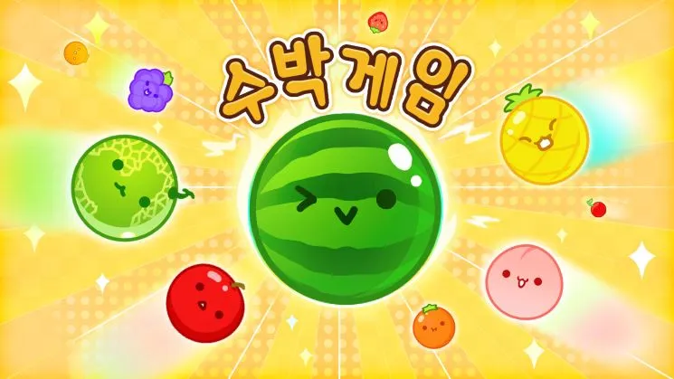
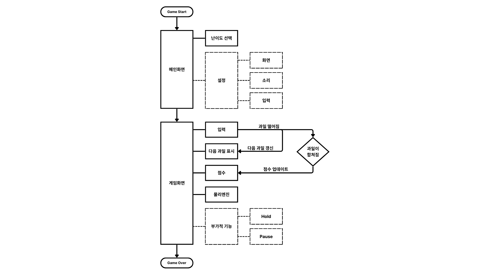

# Python WatermelonGame Project from CAU OpenSourceProgramming
----
----
## 프로젝트 소개


### Suika Game이란?
<p align="center"></p>


2023년 9월, 인터넷 방송인들 사이에서 일명 “수박게임”이라고 불리는 “Suika Game”이 유행했다. 방송과 영상의 주된 컨텐츠가 게임인 인터넷 방송인들은 물론이고, 다른 컨텐츠를 다루는 인터넷 방송인도 단기적인 컨텐츠로 Suika Game을 소비했다. 2,500원이라는 저렴한 가격과 낮은 진입장벽 덕에 역주행에 성공한 듯하다.

2021년 12월 9일에 출시되었으나 인기를 끈 것은 비교적 최근이다. 또한 개발사이자 유통사인 Aladdin X는 원래 게임을 만드는 회사가 아니라, 가정용 빔 프로젝터를 만드는 회사이다. Aladdin X에서 제조한 popIn Aladdind이라는 제품에 내장될 미니게임을 만들기 위해서 다른 게임을 벤치마킹하여 만든 게임이다. 원본의 소스코드는 중국의 liyupi라는 인물이 GitHub을 통해 배포한 “合成大西瓜”(합성대서과)이다. JavaSript로 작성되었고, 이미지를 수정하거나 효과음, 음악, 물리엔진까지도 수정이 가능하다.

게임의 플레이 방식 자체가 이해하기 쉽다. 위에서 과일을 떨어뜨려 같은 과일끼리 합치고, 합쳐진 과일은 상위 레벨의 과일이 되는 고전적인 퍼즐 방식의 퍼즐 게임이다. 상위 레벨의 과일일수록 크기가 커서 과일을 넣을 수 있는 공간이 제한된다. 그러나 최종 단계인 수박끼리 합치게 되면 두 수박이 사라지면서 공간이 확보되어 게임을 이어나갈 수 있다. 간단한 방식의 게임이었기 때문에, 지원되는 언어가 일본어뿐이었어도 문제되지는 않았다. 많은 사람들에게 인기를 끌면서 최근에는 영어와 한국어 지원을 시작했다.

하지만 Suika Game은 닌텐도 e숍에서만 구매가 가능하고 다른 플랫폼에서는 지원되지 않기 때문에 닌텐도 스위치가 없으면 할 수 없다는 단점이 있다. 그래서 이와 유사한 게임을 만들어서 제공하는 움직임도 많았다. 구성 요소들을 과일이 아닌 다른 요소로 바꾸거나, 웹에서 플레이할 수 있게 변경한 버전도 있다. 하지만 사람들은 인터넷 방송인들과 같은 버전의 게임을 하고 싶어 했다. 양산된 다양한 버전의 수박게임은 닌텐도 스위치를 구매하기 어려운 사람들만 즐기는 대체품의 불과하다는 평이 많다. 오픈 소스를 바탕으로 너무 많은 게임이 양산되면서 독창적이지 않고 중복된 게임이 시장을 지배하는 것도 문제로 지적되기도 한다.
 
<br/>

### 프로젝트 목적 및 진행방향
이 프로젝트는 중앙대학교 예술공학대학의 오픈소스프로그래밍 수업 중, GitHub를 사용하여 프로젝트를 진행하는 방법을 경험하고, 팀원과 협력하여 개발하는 것을 주된 목적으로 한다. GitHub의 다양한 기능을 이용해서 버전을 관리하고 각자의 로컬 환경에서 동시에 작업할 수 있다는 점을 이용한다.

이 프로젝트에서 우리는 앞서 말한 "수박게임"을 구현하고자 한다. 기존 JavaScript의 코드를 Python으로 완성도 있게 옮겨오는 것을 목표로 하고, 이를 기반으로 추가 기능을 구현하는 것으로 계획했다. 수박게임은 랜덤하게 내려오는 객체를 전략적으로 배치하여 제한 높이를 넘기지 않으면서 높은 점수를 기록해야하는 게임이다. 때문에 테트리스와 유사한 부분이 많다. 테트리스는 오래된 역사의 게임인 만큼 그 바리에이션의 폭이 넓다. 그 넓은 바리에이션의 일부를 구현하여 수박게임을 더욱 풍성하게 만들 수 있을 것으로 생각된다.

그러나 JavaScript와 Python의 차이 때문에 공개되어있는 소스코드를 참고한다고 하더라도 이를 완벽하게 구현하는 것은 어려운 일이었다. 기한 내에 프로젝트를 마무리하기 위해서, JuwonHwang의 WatermelonGame을 참고하였다. Python으로 작성된 수박게임의 카피버전이다. 이 코드를 이용해서 기한 내에 프로젝트를 일정 수준에 도달하도록 할 수 있었다. 타인이 공개한 코드를 적절히 이용할 수 있다는 것도 오픈 소스의 큰 장점이다. 타인의 코드를 이용하면서 시간이 크게 단축되었다.

<br/>

----
----

 
## 사용 방법
 
### 프로젝트 환경
이 프로젝트는 Python 3.12 (64bit)로 작성되었습니다. 이는 작성 당시 가장 최신 버전의 Python으로 아직 visual studio 등에서 지원하지 않아 일부 기능이 올바르게 동작하지 않을 수 있습니다.

```
import pymunk
import pygame
import sys
import numpy as np
```
위와 같은 라이브러리를 import하고 있습니다. 해당 라이브러리가 설치되어있지 않으면 동작하지 않습니다. 

<br/>

### 플레이 방법

#### 기본 조작

**좌우 방향키**와 **스페이스바**를 이용해서 플레이할 수 있습니다. 좌우 방향키를 이용해서 오브젝트를 떨어뜨릴 위치를 조정할 수 있고, 스페이스바를 눌러서 해당 위치에서 떨어뜨릴 수 있습니다.

#### 다음 오브젝트
화면의 오른쪽 공간은 추가적인 정보를 제공합니다. 현재 오브젝트 다음에 올 오브젝트를 보여줍니다. 이 정보를 통해서 보다 전략적으로 오브젝트를 배치할 수 있습니다.

#### 오브젝트 홀드
키보드 **H키**를 눌러서 홀드(hold)기능을 사용할 수 있습니다. 홀드 기능을 처음 사용하면, 현재 떨어뜨리기 위해 대기중인 오브젝트를 저장해둘 수 있습니다. 홀드 기능을 다시 사용하면, 대기 중인 오브젝트와 저장한 오브젝트를 서로 교환할 수 있습니다. 이 기능을 이용해서 보다 전략적으로 오브젝트를 배치할 수 있습니다.

#### 충격량 조절
게임이 시작되기 전, **A키**와 **D키**를 이용해서 오브젝트의 충격량(impulse_level)을 조절할 수 있습니다. 오브젝트를 떨어뜨리기 시작하면 해당 게임 동안은 오브젝트의 충격량을 조절할 수 없습니다. 

#### 초기화
키보드 **R키**를 눌러서 현재 진행상황을 초기화 할 수 있습니다.

<br/>

----
----

 
## 구현 기능
 
### 구현된 기능

#### 기존 코드에서 구현된 기능
```
def post_solve_arbiter(arbiter, space, data):
    for contact in arbiter.contact_point_set.points:
        impulse = arbiter.total_impulse * impulse_level
        body1, body2 = arbiter.shapes
        body1.body.apply_impulse_at_world_point(impulse, contact.point_a)
        body2.body.apply_impulse_at_world_point(-impulse, contact.point_b)
```
```body1```과 ```body2```가 충돌한다고 했을때, 서로 주고 받는 힘에 대한 함수이다. ```arbiter.total_impulse```로 완전탄성충돌에서의 충격량을 계산하고, 여기에 0에서 1 사이의 값을 갖는 ```impulse_level```을 곱해서 물체의 탄성을 조절한다. 이 때 ```body1```과 ```body2```가 충돌하면서 그 충격은 반대방향이 된다. 함수 ```post_solve_arbiter2```를 보면 게임 공간에서 벽의 경우 충돌해도 움직이지 않기 때문에 물체만 힘을 받고 벽은 힘을 받지 않는다.

<br/>

```
def add_object(radius, x, y):
    object = Object(radius, x, y)
    circle = pymunk.Circle(object, object.radius)
    circle.elasticity = 0.2
    object.circle = circle
    return object, circle
```
물리엔진이 적용되는 오브젝트를 생성하는 함수이다. 

<br/>

#### 주요 변경 사항
기존 코드의 형태는 대부분 유지하였으나, 자주 사용되거나 한 함수의 크기가 너무 커질 경우 부분적으로 함수를 새롭게 선언하여 모듈화하였다.

```
def update(self, action):
    self.eventHandle(action)
            
    self.collisionHandle()
        
    self.limitHandle()
        
    self.statusHandle()
```
모듈화를 통해서 코드의 가독성을 높이고 유지보수가 수월해졌다.

<br/>

```
def draw_base(self):
    global impulse_level
    self.screen.fill(WHITE)
    # 경계선
    pygame.draw.line(self.screen, BLACK, (0, self.SCREEN_HEIGHT), (self.SCREEN_WIDTH/2, self.SCREEN_HEIGHT), 20)
    pygame.draw.line(self.screen, BLACK, (0, self.SCREEN_HEIGHT), (0, 0), 20)
    pygame.draw.line(self.screen, BLACK, (self.SCREEN_WIDTH/2, self.SCREEN_HEIGHT), (self.SCREEN_WIDTH/2, 0), 20)
    # 상한선
    pygame.draw.line(self.screen, RED, (10, LIMIT_HEIGHT), (self.SCREEN_WIDTH/2-10, LIMIT_HEIGHT), 4)
    
    # Next
    pygame.draw.line(self.screen, BLACK, (450, 30), (450, 130), 10)
    pygame.draw.line(self.screen, BLACK, (450, 130), (550, 130), 10)
    pygame.draw.line(self.screen, BLACK, (550, 30), (550, 130), 10)
    pygame.draw.line(self.screen, BLACK, (450, 30), (550, 30), 10)
    next_text = self.font_arial.render(f"NEXT", True, BLACK)
    self.screen.blit(next_text, (473, 135))
    pygame.draw.circle(self.screen, object_color(self.next_radius), (500, 80), self.next_radius)
   
    # Hold
    pygame.draw.line(self.screen, BLACK, (450, 230), (450, 330), 10)
    pygame.draw.line(self.screen, BLACK, (450, 330), (550, 330), 10)
    pygame.draw.line(self.screen, BLACK, (550, 230), (550, 330), 10)
    pygame.draw.line(self.screen, BLACK, (450, 230), (550, 230), 10)
    next_text = self.font_arial.render(f"HOLD", True, BLACK)
    self.screen.blit(next_text, (473, 335))
    if self.hold_radius is not None :
        pygame.draw.circle(self.screen, object_color(self.hold_radius), (500, 280), self.hold_radius)
   
    # 탄성계수
    impulse_text = self.font_arial.render(f"impulse: {"{:.2f}".format(impulse_level)}", True, BLACK)
    self.screen.blit(impulse_text, (450, 430))
    # 점수
    score_text = self.font_arial.render(f"score: {self.score}", True, BLACK)
    self.screen.blit(score_text, (450, 530))
```
게임의 기본 틀을 그린다. 


### 구현할 기능
 
 
현재까지 논의된 추가 기능은 다음과 같다.
- 게임을 중간에 멈출 수 있는 pause 기능
- ~~다음에 떨어질 객체를 보여주는 기능~~
- ~~이번에 떨어질 객체를 hold해 두었다가 나중에 사용하는 기능~~
- ~~객체가 튕기는 반발 값을 플레이어가 설정하는 난이도 조절 기능~~
 
<p align="center"></p> 
 
 
## 참고링크
- [Aladdin X - 수박게임](https://www.aladdinx.jp/pages/suika-game "Aladdin X - suika game")
- [Nintendo - 수박게임 소개](https://www.nintendo.co.kr/news/article/1LhrKTUldgxqGObCoCWoZP "Nintendo. 과일을 성장시켜 수박으로 만들자. 『수박게임』을 아시나요?.")
- [Wikipedia - Suika Game](https://en.wikipedia.org/wiki/Suika_Game "위키피디아 - 수박게임")
- [liyupi - daxigua (원본 오픈소스)](https://github.com/liyupi/daxigua "github - liyupi - daxigua")
- [seigot - tetris](https://github.com/seigot/tetris "github - seigot - tetris")
- [JuwonHwang - WatermelonGame (참고한 코드)](https://github.com/JuwonHwang/WatermelonGame "github - JuwonHwang - WatermelonGame")
